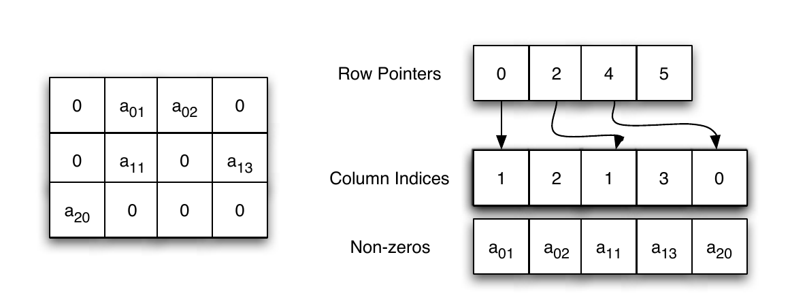

# Sparse Representations {#sparse}

Analyzing "bigdata" in R is a challenge because the workspace is memory resident, i.e., all your objects are stored in RAM.
As a rule of thumb, fitting models requires about 5 times the size of the data. 
This means that if you have 1 GB of data, you might need about 5 GB to fit a linear models.
We will discuss how to compute _out of RAM_  in the Memory Efficiency Chapter \@ref(memory).
In this chapter, we discuss efficient representations of your data, so that it takes less memory.
The fundamental idea, is that if your data is _sparse_, i.e., there are many zero entries in your data, then a naive `data.frame` or `matrix` will consume memory for all these zeroes. 
If, however, you have many recurring zeroes, it is more efficient to save only the non-zero entries.

When we say _data_, we actually mean the `model.matrix`.
The `model.matrix` is a matrix that R grows, converting all your factors to numeric variables that can be computed with.
_Dummy coding_ of your factors, for instance, is something that is done in your `model.matrix`.
If you have a factor with many levels, you can imagine that after dummy coding it, many zeroes will be present.

The __Matrix__ package replaces the `matrix` class, with several sparse representations of matrix objects. 

When using sparse representation, and the __Matrix__ package, you will need an implementation of your favorite model fitting algorithm (e.g. `lm`) that is adapted to these sparse representations; otherwise, R will cast the sparse matrix into a regular (non-sparse) matrix, and you will have saved nothing in RAM.

```{remark}
If you are familiar with MATLAB you should know that one of the great capabilities of MATLAB, is the excellent treatment of sparse matrices with the `sparse` function.
```


Before we go into details, here is a simple example.
We will create a factor of letters with the `letters` function.
Clearly, this factor can take only $26$ values. 
This means that $25/26$ of the `model.matrix` will be zeroes after dummy coding.
We will compare the memory footprint of the naive `model.matrix` with the sparse representation of the same matrix. 

```{r make x, cache=TRUE}
library(magrittr)
reps <- 1e6 # number of samples
y<-rnorm(reps)
x<- letters %>% 
  sample(reps, replace=TRUE) %>% 
  factor
```

The object `x` is a factor of letters:
```{r}
head(x)
```

We dummy code `x` with the `model.matrix` function.

```{r make X1, cache=TRUE}
X.1 <- model.matrix(~x-1)
head(X.1)
```

We call __MatrixModels__ for an implementation of `model.matrix` that supports sparse representations.

```{r make X2, cache=TRUE}
suppressPackageStartupMessages(library(MatrixModels))
X.2<- as(x,"sparseMatrix") %>% t # Makes sparse dummy model.matrix
head(X.2)
```

Notice that the matrices have the same dimensions:

```{r}
dim(X.1)
dim(X.2)
```

The memory footprint of the matrices, given by the `pryr::object_size` function, are very very different.

```{r}
pryr::object_size(X.1)
pryr::object_size(X.2)
```

Things to note:

- The sparse representation takes a whole lot less memory than the non sparse. 
- The `as(,"sparseMatrix")` function grows the dummy variable representation of the factor `x`.
- The __pryr__ package provides many facilities for inspecting the memory footprint of your objects and code. 


With a sparse representation, we not only saved on RAM, but also on the computing time of fitting a model.
Here is the timing of a non sparse representation:

```{r nonSparse lm, cache=TRUE, dependson='make X1'}
system.time(lm.1 <- lm(y ~ X.1)) 
```

Well actually, `lm` is a wrapper for the `lm.fit` function. 
If we override all the overhead of `lm`, and call `lm.fit` directly, we gain some time:

```{r nonSparse lmfit, cache=TRUE, dependson='make X1'}
system.time(lm.1 <- lm.fit(y=y, x=X.1))
```

We now do the same with the sparse representation:

```{r sparselm, cache=TRUE, dependson='make X2'}
system.time(lm.2 <- MatrixModels:::lm.fit.sparse(X.2,y))
```

It is only left to verify that the returned coefficients are the same:

```{r}
all.equal(lm.2, unname(lm.1$coefficients), tolerance = 1e-12)
```

You can also visualize the non zero entries, i.e., the sparsity structure.

```{r}
image(X.2[1:26,1:26])
```


## Sparse Matrix Representations

We first distinguish between the two main goals of the efficient representation:
(i) efficient writing, i.e., modification; 
(ii) efficient reading, i.e., access. 
For our purposes, we will typically want efficient reading, since the `model.matrix` will not change while a model is being fitted.

Representations designed for writing include the _dictionary of keys_, _list of lists_, and a _coordinate list_. 
Representations designed for efficient reading include the _compressed sparse row_ and _compressed sparse column_.


### Coordinate List Representation {#coo}
A _coordinate list representation_, also known as _COO_, or _triplet represantation_ is simply a list of the non zero entries. 
Each element in the list is a triplet of the column, row, and value, of each non-zero entry in the matrix.


### Compressed Column Oriented Representation 
A _compressed column oriented representation_, also known as _compressed sparse column_, or _CSC_, where the __column__ index is similar to COO, but instead of saving the row indexes, we save the locations in the column index vectors where the row index has to increase. 
The following figure may clarify this simple idea.



The nature of statistical applications is such, that CSC representation is typically the most economical, justifying its popularity.


### Compressed Row Oriented Representation 
A _compressed row oriented representation_, also known as _compressed sparse row_, or _CSR_, is very similar to CSC, after switching the role of rows and columns.
CSR is much less popular than CSC.


### Sparse Algorithms

We will go into the details of some algorithms in the Numerical Linear Algebra Chapter \@ref(algebra).
For our current purposes two things need to be emphasized:

1. Working with sparse representations requires using a function that is aware of the representation you are using. 

1. A mathematician may write $Ax=b \Rightarrow x=A^{-1}b$. This is a [predicate](https://en.wikipedia.org/wiki/Predicate_(mathematical_logic)) of $x$,i.e., a property that $x$ satisfies, which helps with its analysis. A computer, however, would __never__ compute $A^{-1}$ in order to find $x$, but rather use one of many endlessly many numerical algorithms. A computer will  typically "search" various  $x$'s until it finds the one that fulfils the predicate. 


## Sparse Matrices and Sparse Models in R

### The Matrix Package

The __Matrix__ package provides facilities to deal with real (stored as double precision), logical and so-called "pattern" (binary) dense and sparse matrices. 
There are provisions to provide integer and complex (stored as double precision complex) matrices.

The sparse matrix classes include:

- `TsparseMatrix`: a virtual class of the various sparse matrices in triplet representation.
- `CsparseMatrix`: a virtual class of the various sparse matrices in CSC representation.
- `RsparseMatrix`: a virtual class of the various sparse matrices in CSR representation.

For matrices of real numbers, stored in _double precision_, the __Matrix__ package provides the following (non virtual) classes:

- `dgTMatrix`: a __general__ sparse matrix of __doubles__, in __triplet__ representation.
- `dgCMatrix`: a __general__ sparse matrix of __doubles__, in __CSC__ representation.
- `dsCMatrix`: a __symmetric__ sparse matrix of __doubles__, in __CSC__ representation.
- `dtCMatrix`: a __triangular__ sparse matrix of __doubles__, in __CSC__ representation.

Why bother with distinguishing between the different shapes of the matrix?
Because the more structure is assumed on a matrix, the more our (statistical) algorithms can be optimized. 
For our purposes `dgCMatrix` will be the most useful.


### The MatrixModels Package
TODO


### The glmnet Package

As previously stated, an efficient storage of the `model.matrix` is half of the story.
We now need implementations of our favorite statistical algorithms that make use of this representation. 
At the time of writing, a very useful package that does that is the __glmnet__ package, which allows to fit linear models, generalized linear models, with ridge, lasso, and elastic net regularization. 
The __glmnet__ package allows all of this, using the sparse matrices of the __Matrix__ package. 

The following example is taken from [John Myles White's blog](http://www.johnmyleswhite.com/notebook/2011/10/31/using-sparse-matrices-in-r/), and compares the runtime of fitting an OLS model, using `glmnet` with both sparse and dense matrix representations. 
```{r sparse glmnet simulation, cache=TRUE}
suppressPackageStartupMessages(library('glmnet'))

set.seed(1)
performance <- data.frame()
 
for (sim in 1:10){
  n <- 10000
  p <- 500
 
  nzc <- trunc(p / 10)
 
  x <- matrix(rnorm(n * p), n, p) #make a dense matrix
  iz <- sample(1:(n * p),
               size = n * p * 0.85,
               replace = FALSE)
  x[iz] <- 0 # sparsify by injecting zeroes
  sx <- Matrix(x, sparse = TRUE) # save as a sparse object
 
  beta <- rnorm(nzc)
  fx <- x[, seq(nzc)] %*% beta
 
  eps <- rnorm(n)
  y <- fx + eps # make data
 
  # Now to the actual model fitting:
  sparse.times <- system.time(fit1 <- glmnet(sx, y)) # sparse glmnet
  full.times <- system.time(fit2 <- glmnet(x, y)) # dense glmnet
  
  sparse.size <- as.numeric(object.size(sx))
  full.size <- as.numeric(object.size(x))
 
  performance <- rbind(performance, data.frame(Format = 'Sparse',
                                                UserTime = sparse.times[1],
                                               SystemTime = sparse.times[2],
                                               ElapsedTime = sparse.times[3],
                                               Size = sparse.size))
  performance <- rbind(performance, data.frame(Format = 'Full',
                                               UserTime = full.times[1],
                                               SystemTime = full.times[2],
                                               ElapsedTime = full.times[3],
                                               Size = full.size))
}

```

Things to note:

- The simulation calls `glmnet` twice. Once with the non-sparse object `x`, and once with its sparse version `sx`.
- The degree of sparsity of `sx` is $85\%$. We know this because we "injected" zeroes in $0.85$ of the locations of `x`. 
- Because `y` is continuous `glmnet` will fit a simple OLS model. We will see later how to use it to fit GLMs and use lasso, ridge, and elastic-net regularization. 

We now inspect the computing time, and the memory footprint, only to discover that sparse representations make a BIG difference. 

```{r}
suppressPackageStartupMessages(library('ggplot2'))
ggplot(performance, aes(x = Format, y = ElapsedTime, fill = Format)) +
  stat_summary(fun.data = 'mean_cl_boot', geom = 'bar') +
  stat_summary(fun.data = 'mean_cl_boot', geom = 'errorbar') +
  ylab('Elapsed Time in Seconds') 
```

```{r}
ggplot(performance, aes(x = Format, y = Size / 1000000, fill = Format)) +
  stat_summary(fun.data = 'mean_cl_boot', geom = 'bar') +
  stat_summary(fun.data = 'mean_cl_boot', geom = 'errorbar') +
  ylab('Matrix Size in MB') 
```


How do we perform other types of regression with the __glmnet__?
We just need to use the `family` and `alpha` arguments of `glmnet::glmnet`.
The `family` argument governs the type of GLM to fit: logistic, Poisson, probit, or other types of GLM.
The `alpha` argument controls the type of regularization. Set to `alpha=0` for ridge, `alpha=1` for lasso, and any value in between for elastic-net regularization.


### The SparseM Package


## Bibliographic Notes

The best place to start reading on sparse representations and algorithms is the [vignettes](http://svitsrv25.epfl.ch/R-doc/library/Matrix/doc/) of the __Matrix__ package. 
@gilbert1992sparse is also a great read for some general background.
For the theory on solving sparse linear systems see @davis2006direct.
For general numerical linear algebra see @gentle2012numerical.


## Practice Yourself
