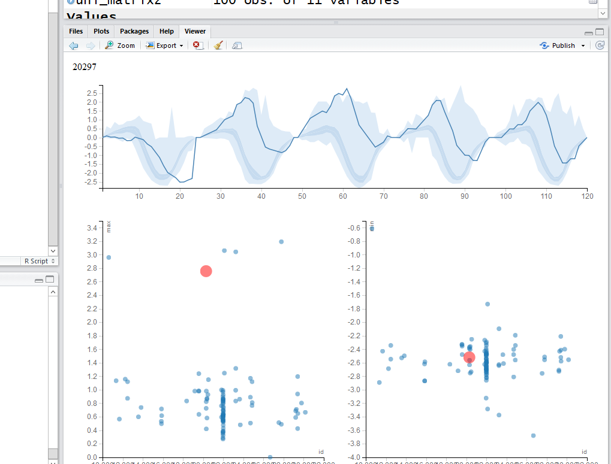

# Exploratory Data Analysis {#eda}


Exploratory Data Analysis (EDA) is a term coined by [John W. Tukey](https://en.wikipedia.org/wiki/John_Tukey) in his seminal book [@tukey1977exploratory].
It is also (arguably) known as _Visual Analytics_, or _Descriptive Statistics_.
It is the practice of inspecting, and exploring your data, before stating hypotheses, fitting predictors, and other more ambitious inferential goals.
It typically includes the computation of simple _summary statistics_ which capture some property of interest in the data, and _visualization_.
EDA can be thought of as an assumption free, purely algorithmic practice.

In this text we present EDA techniques along the following lines:

- How we explore: with summary-statistics, or visually?
- How many variables analyzed simultaneously: univariate, bivariate, or multivariate?
- What type of variable: categorical or continuous?


## Summary Statistics

### Categorical Data
Categorical variables do not admit any mathematical operations on them. 
We cannot sum them, or even sort them. 
We can only __count__ them. 
As such, summaries of categorical variables will always start with the counting of the frequency of each category.

#### Summary of Univariate Categorical Data

```{r}
# Make some data
gender <- c(rep('Boy', 10), rep('Girl', 12))
drink <- c(rep('Coke', 5), rep('Sprite', 3), rep('Coffee', 6), rep('Tea', 7), rep('Water', 1))  
age <-  sample(c('Young', 'Old'), size = length(gender), replace = TRUE)
# Count frequencies
table(gender)
table(drink)
table(age)
```

If instead of the level counts you want the proportions, you can use `prop.table`

```{r}
prop.table(table(gender))
```


#### Summary of Bivariate Categorical Data

```{r}
library(magrittr)
cbind(gender, drink) %>% head # bind vectors into matrix and inspect (`c` for column)
table1 <- table(gender, drink) # count frequencies of bivariate combinations
table1										
```

#### Summary of Multivariate Categorical Data
You may be wondering how does R handle tables with more than two dimensions.
It is indeed not trivial to report this in a human-readable way. 
R offers several solutions: `table` is easier to compute with, and `ftable` is human readable.

```{r}
table2.1 <- table(gender, drink, age) # A machine readable table. 
table2.1
table.2.2 <- ftable(gender, drink, age) # A human readable table (`f` for Flat).
table.2.2
```

If you want proportions instead of counts, you need to specify the denominator, i.e., the margins. 
Think: what is the margin in each of the following outputs?

```{r}
prop.table(table1, margin = 1) # every *row* sums to to 1
prop.table(table1, margin = 2) # every *column* sums to 1
```


### Continous Data
Continuous variables admit many more operations than categorical.
We can compute sums, means, quantiles, and more.

#### Summary of Univariate Continuous Data
We distinguish between several types of summaries, each capturing a different property of the data.

#### Summary of Location
Capture the "location" of the data. These include:

```{definition, name="Average"}
The mean, or average, of a sample $x:=(x_1,\dots,x_n)$, denoted $\bar x$ is defined as 
$$ \bar x := n^{-1} \sum x_i. $$
```

The sample mean is __non robust__. 
A single large observation may inflate the mean indefinitely.
For this reason, we define several other summaries of location, which are more robust, i.e., less affected by "contaminations" of the data.

We start by defining the sample quantiles, themselves __not__ a summary of location.

```{definition, name="Quantiles"}
The $\alpha$ quantile of a sample $x$, denoted $x_\alpha$, is (non uniquely) defined as a value above $100 \alpha \%$ of the sample, and below $100 (1-\alpha) \%$.
```

We emphasize that sample quantiles are non-uniquely defined. See `?quantile` for the 9(!) different definitions that R provides. 

Using the sample quantiles, we can now define another summary of location, the __median__.

```{definition, name="Median"}
The median of a sample $x$, denoted $x_{0.5}$ is the $\alpha=0.5$ quantile of the sample.
```

A whole family of summaries of locations is the __alpha trimmed mean__.

```{definition, name="Alpha Trimmed Mean"}
The $\alpha$ trimmed mean of a sample $x$, denoted $\bar x_\alpha$ is the average of the sample after removing the $\alpha$ proportion of largest and $\alpha$ proportion of smallest observations.
```

The simple mean and median are instances of the alpha trimmed mean: $\bar x_0$ and $\bar x_{0.5}$ respectively.

Here are the R implementations:

```{r}
x <- rexp(100) # generate some (assymetric) random data
mean(x) # simple mean
median(x) # median
mean(x, trim = 0.2) # alpha trimmed mean with alpha=0.2
```


#### Summary of Scale
The _scale_ of the data, sometimes known as _spread_, can be thought of its variability. 

```{definition, name="Standard Deviation"}
The standard deviation of a sample $x$, denoted $S(x)$, is defined as 
$$ S(x):=\sqrt{(n-1)^{-1} \sum (x_i-\bar x)^2} . $$
```

For reasons of robustness, we define other, more robust, measures of scale.

```{definition, name="MAD"}
The Median Absolute Deviation from the median, denoted as $MAD(x)$, is defined as
$$MAD(x):= c \: |x-x_{0.5}|_{0.5} . $$
```

where $c$ is some constant, typically set to $c=1.4826$ so that MAD and $S(x)$ have the same large sample limit.

```{definition, name="IQR"}
The Inter Quartile Range of a sample $x$, denoted as $IQR(x)$, is defined as 
$$ IQR(x):= x_{0.75}-x_{0.25} .$$
```

Here are the R implementations

```{r}
sd(x) # standard deviation
mad(x) # MAD
IQR(x) # IQR
```


#### Summary of Asymmetry
Summaries of asymmetry, also known as _skewness_, quantify the departure of the $x$ from a symmetric sample.

```{definition, name="Yule"}
The Yule measure of assymetry, denoted $Yule(x)$ is defined as 
$$Yule(x) := \frac{1/2 \: (x_{0.75}+x_{0.25}) - x_{0.5} }{1/2 \: IQR(x)} .$$
```

Here is an R implementation

```{r yule}
yule <- function(x){
  numerator <- 0.5 * (quantile(x,0.75) + quantile(x,0.25))-median(x) 
  denominator <- 0.5* IQR(x)
  c(numerator/denominator, use.names=FALSE)
}
yule(x)
```

Things to note:

- A perfectly symmetric vector will return 0 because the median will be exactly on the midway.
- It is bounded between -1 and 1 because of the denominator


#### Summary of Bivariate Continuous Data
When dealing with bivariate, or multivariate data, we can obviously compute univariate summaries for each variable separately. 
This is not the topic of this section, in which we want to summarize the association __between__ the variables, and not within them.

```{definition, name="Covariance"}
The covariance between two samples, $x$ and $y$, of same length $n$, is defined as 
$$Cov(x,y):= (n-1)^{-1} \sum (x_i-\bar x)(y_i-\bar y)  $$
```

We emphasize this is not the covariance you learned about in probability classes, since it is not the covariance between two _random variables_ but rather, between two _samples_. 
For this reasons, some authors call it the _empirical covariance_, or _sample covariance_.

```{definition, name="Pearson's Correlation Coefficient"}
Peasrson's correlation coefficient, a.k.a. Pearson's moment product correlation, or simply, the correlation, denoted `r(x,y)`, is defined as 
$$r(x,y):=\frac{Cov(x,y)}{S(x)S(y)}. $$
```

If you find this definition enigmatic, just think of the correlation as the covariance between $x$ and $y$ after transforming each to the unitless scale of z-scores.

```{definition, name="Z-Score"}
The z-scores of a sample $x$ are defined as the mean-centered, scale normalized observations:
$$z_i(x):= \frac{x_i-\bar x}{S(x)}.$$ 
```

We thus have that $r(x,y)=Cov(z(x),z(y))$. 

Here are the R implementations

```{r}
y <- rexp(100) # generate another vector of some random data
cov(x,y) # covariance between x and y
cor(x,y) # correlation between x and y (default is pearson)
scale(x) %>% head # z-score of x
```


#### Summary of Multivariate Continuous Data

The covariance is a simple summary of association between two variables, but it certainly may not capture the whole "story" when dealing with more than two variables. 
The most common summary of multivariate relation, is the __covariance matrix__, but we warn that only the simplest multivariate relations are fully summarized by this matrix. 

```{definition, name="Sample Covariance Matrix"}
Given $n$ observations on $p$ variables, denote $x_{i,j}$ the $i$'th observation of the $j$'th variable. 
The _sample covariance matrix_, denoted $\hat \Sigma$ is defined as 
$$\hat \Sigma_{k,l}=(n-1)^{-1} \sum_i [(x_{i,k}-\bar x_k)(x_{i,l}-\bar x_l)],$$
where $\bar x_k:=n^{-1} \sum_i x_{i,k}$. 
Put differently, the $k,l$'th entry in $\hat \Sigma$ is the sample covariance between variables $k$ and $l$.
```

```{remark}
$\hat \Sigma$ is clearly non robust.
How would you define a robust covariance matrix?
```


## Visualization
Summarizing the information in a variable to a single number clearly conceals much of the story in the sample. 
This is like inspecting a person using a caricature, instead of a picture. 
Visualizing the data, when possible, is more informative. 

### Categorical Data
Recalling that with categorical variables we can only count the frequency of each level, the plotting of such variables are typically variations on the _bar plot_.

#### Visualizing Univariate Categorical Data

```{r, barplot}
barplot(table(age))
```


#### Visualizing Bivariate Categorical Data
There are several generalizations of the barplot, aimed to deal with the visualization of bivariate categorical data. 
They are sometimes known as the _clustered bar plot_ and the _stacked bar plot_.
In this text, we advocate the use of the _mosaic plot_ which is also the default in R.
```{r}
plot(table1, main='Bivariate mosaic plot')
```

Things to note:

- The proportion of each category is encoded in the width of the bars (more girls than boys here)
- Zero observations are marked as a line. 

#### Visualizing Multivariate Categorical Data 
The _mosaic plot_ is not easy to generalize to more than two variables, but it is still possible (at the cost of interpretability).

```{r}
plot(table2.1, main='Trivaraite mosaic plot')
```

When one of the variables is a (discrete) time variable, then the plot has a notion dynamics in time. For this see the Alluvial plot \@ref(alluvial).

If the variables represent a hierarchy, consider a __Sunburst Plot__:
```{r sunburst}
library(sunburstR)
# read in sample visit-sequences.csv data provided in source
# https://gist.github.com/kerryrodden/7090426#file-visit-sequences-csv
sequences <- read.csv(
  system.file("examples/visit-sequences.csv",package="sunburstR")
  ,header=F
  ,stringsAsFactors = FALSE
)
sunburst(sequences) # In the HTML version of the book this plot is interactive.
```


### Continuous Data

#### Visualizing Univariate Continuous Data
Unlike categorical variables, there are endlessly many ways to visualize continuous variables. 
The simplest way is to look at the raw data via the `stripchart`.

```{r}
sample1 <- rexp(10) 							
stripchart(sample1)
```

Clearly, if there are many observations, the `stripchart` will be a useless line of black dots. 
We thus bin them together, and look at the frequency of each bin; this is the _histogram_.
R's `histogram` function has very good defaults to choose the number of bins.
Here is a histogram showing the counts of each bin.
```{r}
sample1 <- rexp(100) 							
hist(sample1, freq=T, main='Counts')      	
```

The bin counts can be replaced with the proportion of each bin using the `freq` argument.
```{r}
hist(sample1, freq=F, main='Proportion') 	
```

Things to note:

- The bins' proportion summary is larger than 1 because it considers each bin's width, which in this case has a constant width of 0.5, hence the total proportion sum is 1/0.5=2.

The bins of a histogram are non overlapping.
We can adopt a sliding window approach, instead of binning. 
This is the _density plot_ which is produced with the `density` function, and added to an existing plot with the `lines` function.
The `rug` function adds the original data points as ticks on the axes, and is strongly recommended to detect artifacts introduced by the binning of the histogram, or the smoothing of the density plot. 

```{r, results='hold'}
hist(sample1, freq=F, main='Frequencies') 	
lines(density(sample1))                   	
rug(sample1)
```

```{remark}
Why would it make no sense to make a table, or a barplot, of continuous data?
```

One particularly useful visualization, due to John W. Tukey, is the _boxplot_.
The boxplot is designed to capture the main phenomena in the data, and simultaneously point to outlines. 

```{r}
boxplot(sample1)	
```

Another way to deal with a massive amount of data points, is to emphasize important points, and conceal non-important. 
This is the purpose of __circle-packing__ (example from [r-graph gallery](https://www.r-graph-gallery.com/308-interactive-circle-packing/)):
```{r, echo=FALSE}
# libraries
library(packcircles)
library(ggplot2)
library(viridis)
library(ggiraph)

# Create data
data=data.frame(group=paste("Group_", sample(letters, 70, replace=T), sample(letters, 70, replace=T), sample(letters, 70, replace=T), sep="" ), value=sample(seq(1,70),70)) 

# Add a column with the text you want to display for each bubble:
data$text=paste("name: ",data$group, "\n", "value:", data$value, "\n", "You can add a story here!")

# Generate the layout
packing <- circleProgressiveLayout(data$value, sizetype='area')
data = cbind(data, packing)
dat.gg <- circleLayoutVertices(packing, npoints=50)

# Make the plot with a few differences compared to the static version:
p=ggplot() + 
  geom_polygon_interactive(data = dat.gg, aes(x, y, group = id, fill=id, tooltip = data$text[id], data_id = id), colour = "black", alpha = 0.6) +
  scale_fill_viridis() +
  geom_text(data = data, aes(x, y, label = gsub("Group_", "", group)), size=2, color="black") +
  theme_void() + 
  theme(legend.position="none", plot.margin=unit(c(0,0,0,0),"cm") ) + 
  coord_equal()


ggiraph(ggobj = p, width_svg = 7, height_svg = 7)
```


#### Visualizing Bivariate Continuous Data
The bivariate counterpart of the `stipchart` is the celebrated scatter plot. 
```{r}
n <- 20
x1 <- rexp(n)
x2 <- 2* x1 + 4 + rexp(n)
plot(x2~x1)
```

A scatter-plot may be augmented with marginal univariate visualization.
See, for instance, the _rug_ function to add the raw data on the margins:
```{r}
plot(x2~x1)
rug(x1,side = 1)
rug(x2,side = 2)
```

A fancier version may use a histogram on the margins:
```{r, echo=FALSE}
library(ggplot2)
library(ggExtra)
set.seed(1234)
x <- c(rnorm(500, mean = -1), rnorm(500, mean = 1.5))
y <- c(rnorm(500, mean = 1), rnorm(500, mean = 1.7))
df3 <- data.frame(x, y)
sp2 <- ggplot(df3,aes(x, y)) + geom_point()
ggMarginal(sp2 + theme_gray(), type = "histogram",
           fill = "steelblue", col = "darkblue")
```


Like the univariate `stripchart`, the scatter plot will be an uninformative mess in the presence of a lot of data. 
A nice bivariate counterpart of the univariate histogram is the _hexbin plot_, which tessellates the plane with hexagons, and reports their frequencies.

```{r}
library(hexbin) # load required library
n <- 2e5
x1 <- rexp(n)
x2 <- 2* x1 + 4 + rnorm(n)
plot(hexbin(x = x1, y = x2))
```


#### Visualizing Multivariate Continuous Data
Visualizing multivariate data is a tremendous challenge given that we cannot grasp $4$ dimensional spaces, nor can the computer screen present more than $2$ dimensional spaces.
We thus have several options: 
(i) To project the data to 2D. This is discussed in the Dimensionality Reduction Section \@ref(dim-reduce).
(ii) To visualize not the raw data, but rather its summaries, like the covariance matrix.

Our own [Multinav](https://github.com/EfratVil/MultiNav) package adopts an interactive approach. 
For each (multivariate) observation a simple univariate summary may be computed and visualized. 
These summaries may be compared, and the original (multivariate) observation inspected upon demand. 
Contact [Efrat](http://efratvil.github.io/home/index.html) for more details.  



An alternative approach starts with the covariance matrix, $\hat \Sigma$, that can be visualized as an image.
Note the use of the `::` operator (called *Double Colon Operator*, for help: `?'::'`), which is used to call a function from some package, without loading the whole package. 
We will use the `::` operator when we want to emphasize the package of origin of a function.

```{r}
covariance <- cov(longley) # The covariance of the longley dataset
correlations <- cor(longley) # The correlations of the longley dataset
lattice::levelplot(correlations)
```

If we believe the covariance has some structure, we can do better than viewing the raw correlations.
In temporal, and spatial data, we believe correlations decay as some function of distances.
We can thus view correlations as a function of the distance between observations. This is known as a _variogram_. 
Note that for a variogram to be informative, it is implied that correlations are merely a function of distances (and not locations themselves). 
This is formally known as _stationary_ and _isotropic_ correlations.


#### Parallel Coordinate Plots {#parcoord}

In a parallel coordinate plot, we plot a multivariate observation as a function of its coordinates. 
In the following example, we visualize the celebrated [Iris dataset](https://en.wikipedia.org/wiki/Iris_flower_data_set). 
In this dataset, for each of 50 iris flowers, Edgar Anderson measured 4 characteristics. 
```{r}
ir <- rbind(iris3[,,1], iris3[,,2], iris3[,,3])
MASS::parcoord(log(ir)[, c(3, 4, 2, 1)], col = 1 + (0:149)%/%50)
```


## Mixed Type Data
Most real data sets will be of mixed type: both categorical and continuous. 
One approach to view such data, is to visualize the continuous variables separately, for each level of the categorical variables. 
There are, however, interesting dedicated visualization for such data. 


### Alluvial Diagram {#alluvial}
An Alluvial plot is a type of [Parallel Coordinate Plot](#parcoord) for multivariate categorical data. 
It is particularly interesting when the $x$ axis is a discretized time variable, and it is used to visualize flow. 

The following example, from the __ggalluvial__ package Vignette by [Jason Cory Brunson](https://cran.r-project.org/web/packages/ggalluvial/vignettes/ggalluvial.html), demonstrates the flow of students between different majors, as semesters evolve. 
```{r}
library(ggalluvial)
data(majors)
majors$curriculum <- as.factor(majors$curriculum)
ggplot(majors,
       aes(x = semester, stratum = curriculum, alluvium = student,
           fill = curriculum, label = curriculum)) +
  scale_fill_brewer(type = "qual", palette = "Set2") +
  geom_flow(stat = "alluvium", lode.guidance = "rightleft",
            color = "darkgray") +
  geom_stratum() +
  theme(legend.position = "bottom") +
  ggtitle("student curricula across several semesters")
```

Things to note:

- We used the __ggalluvial__ package of the __ggplot2__ ecosystem. More on __ggplot2__ in the [Plotting Chapter](#plotting).
- Time is on the $x$ axis. Categories are color coded.

```{remark}
If the width of the lines encode magnitude, the plot is also called a Sankey diagram.
```


## Bibliographic Notes

Like any other topic in this book, you can consult @venables2013modern.
The seminal book on EDA, written long before R was around, is @tukey1977exploratory.
For an excellent text on robust statistics see @wilcox2011introduction.


## Practice Yourself

1. Read about the Titanic data set using `?Titanic`. Inspect it with the `table` and with the `ftable` commands. Which do you prefer?

1. Inspect the Titanic data with a plot. Start with `plot(Titanic)` Try also `lattice::dotplot`. Which is the passenger category with most survivors? Which plot do you prefer? Which scales better to more categories?

1. Read about the women data using `?women`. 
    1. Compute the average of each variable. What is the average of the heights?
    1. Plot a histogram of the heights. Add ticks using `rug`.
    1. Plot a boxplot of the weights. 
    1. Plot the heights and weights using a scatter plot. Add ticks using `rug`.

1. Choose $\alpha$ to define a new symmetry measure: $1/2(x_\alpha+x_{1-\alpha})-x_{0.5}$.
Write a function that computes it, and apply it on women's heights data. 

1. Compute the covariance matrix of women's heights and weights. Compute the correlation matrix. View the correlation matrix as an image using `lattice::levelplot`. 

1. Pick a dataset with two LONG continous variables from `?datasets`. Plot it using `hexbin::hexbin`.
