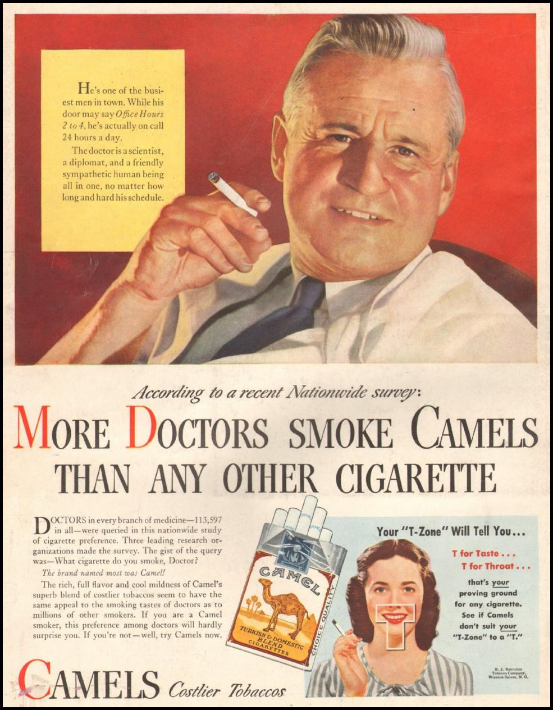

# Causal Inferense {#causality}

Recall this fun advertisement
```{r, echo=FALSE}

```

How come everyone in the past did not know what every kid knows these days: that cigarettes are bad for you.
The reason is the difficulty in causal inference. 
Scientists knew about the correlations between smoking and disease, but no one could prove one caused the other. These could have been nothing more than correlations, with some external cause. 

Cigarettes were declared dangerous without any direct causal evidence. 
It was in the USA's [surgeon general report of 1964](https://profiles.nlm.nih.gov/ps/retrieve/Narrative/NN/p-nid/60) that it was decided that despite of the impossibility of showing a direct causal relation, the circumstantial evidence is just too strong, and declared cigarettes as dangerous. 

## Causal Inference From Designed Experiments


### Design of Experiments
https://cran.r-project.org/web/views/ExperimentalDesign.html

TODO

### Randomized Inference
https://dimewiki.worldbank.org/wiki/Randomization_Inference

TODO

## Causal Inference from Observational Data

### Principal Stratification

@frumento2012evaluating

https://en.wikipedia.org/wiki/Principal_stratification

TODO


### Instrumental Variables
TODO

### Propensity Scores
TODO

### Direct Lieklihood
TODO

### Regression Discontinuity

## Bibliographic Notes

On the tail behind "smoking causes cancer" see [NIH's Reports of the Surgeon General](https://profiles.nlm.nih.gov/ps/retrieve/Narrative/NN/p-nid/60).

## Practice Yourself
